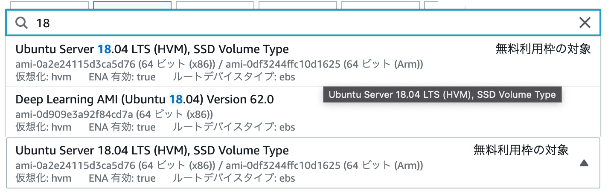
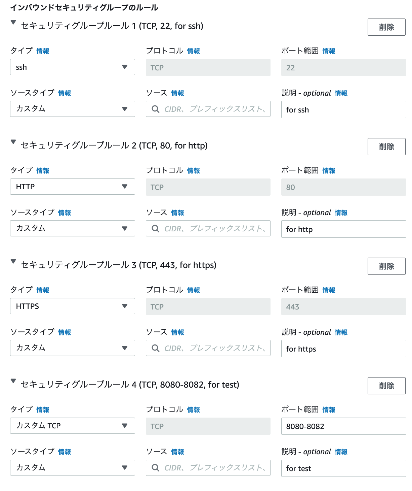
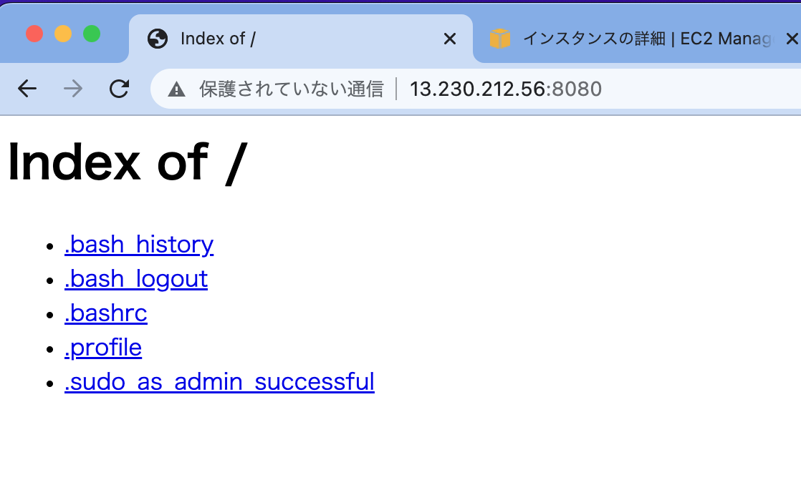
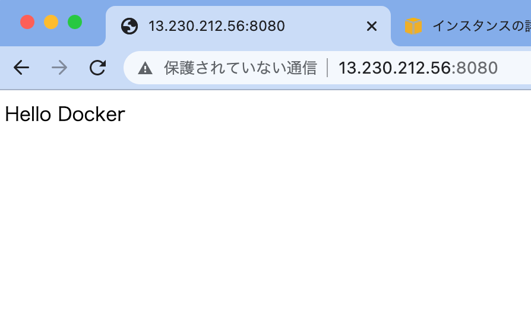
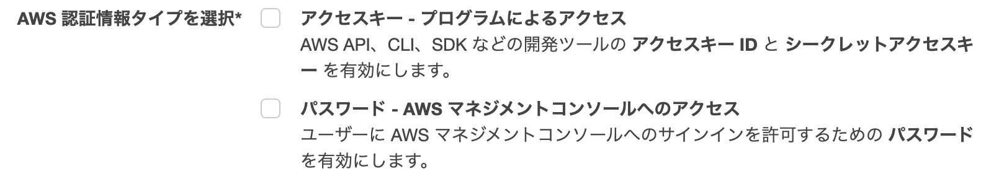
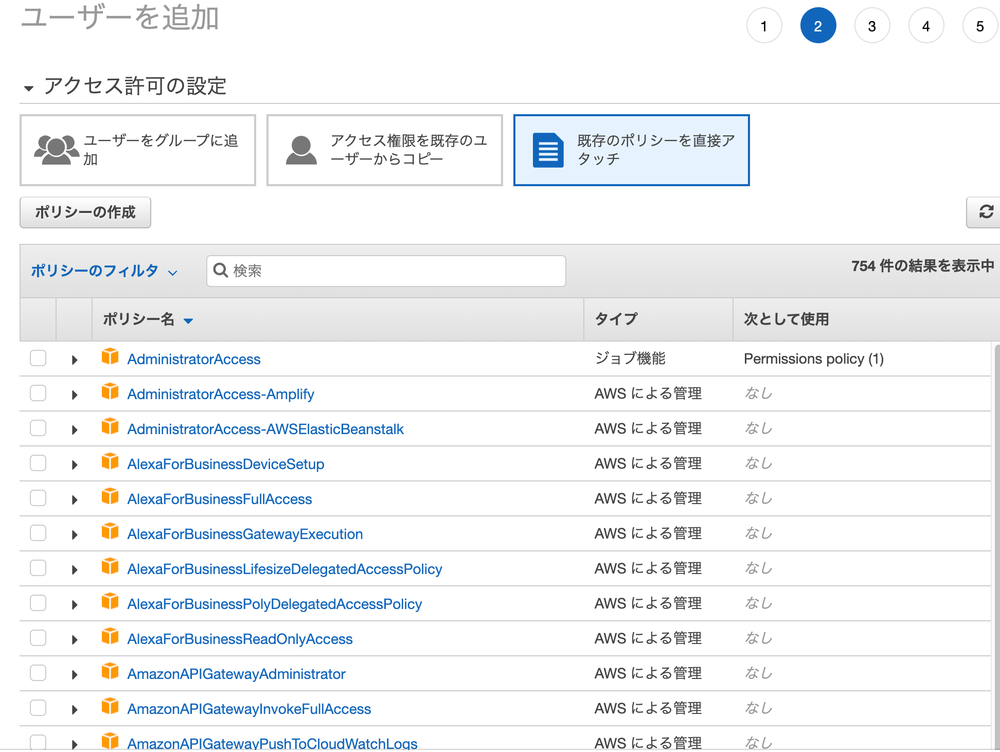
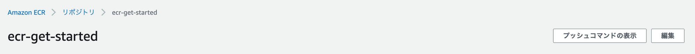

# EC2上にDocker環境を用意する

1. UbuntuをインストールしたEC2インスタンスの準備
2. セキュリティグループの設定 ( ここでは通信を許可するポートの設定のこと )
3. EC2インスタンスへSSH接続
4. DockerEngineインストール
5. DockerComposeインストール

:::note info
2022/7時点の手順です。
:::

## UbuntuをインストールしたEC2インスタンスの準備 + セキュリティグループの設定

1. [https://aws.amazon.com/jp/console/](https://aws.amazon.com/jp/console/)にアクセスし、**コンソールにサインイン**する
2. 検索欄にEC2と入力し、**EC2のダッシュボードを開く**
3. 画面左の「インスタンス」 > **「インスタンスを起動」**を選択。
4. インスタンスの名前を入力。
5. **アプリケーションおよび OS イメージ (Amazon マシンイメージ)でUbuntuのAMIを選択**。
今回は UbuntuServer18.04LTS(HVM),SSDVolumeType を使用する。


6. **インスタンスタイプを選ぶ**。今回は t2.micro を使用する。
7. **キーペアを選択する。**初めてEC2を使う場合、「キーペアの作成」を選択して適当なキーペア名を入力する。
:::note info
キーペアを作成すると自動的に `キーペア名.pem` ファイルがダウンロードされる。EC2インスタンスへのアクセスに必須なので、無くさないようにする。また、漏洩しないようにする。
:::

8. **インバウンドセキュリティグループのルールの「Add security group」を選択**、必要な通信を通す。
    - 設定例 : ssh, HTTP, HTTPS, テスト用のカスタムTCP(`8080~8082`)を通した状態。
    
    - **ソース**欄ではインスタンスに到達できるトラフィックを単一のIPアドレス or CIDR表記で指定する。
9. **ストレージの設定**。Dockerの学習目的の場合、デフォルトの8GBだと少ないため、20GBに変更する。
10.  **インスタンスを起動する**。数分するとインスタンスが実行中になる。
    - インスタンスは起動時間に応じて課金されるため、使用していない時は停止すると良い。

### 補足: CIDR表記

CIDR表記(Classless Inter-Domain Routing)とは、ネットワークアドレスとサブネットマスクのビット数を`/`区切りで書く記法。

```
[ネットワークアドレス]/[サブネットマスクのビット数]
```

参考

- [CIDR表記（プレフィックス表記）とは - 意味をわかりやすく - IT用語辞典 e-Words](https://e-words.jp/w/CIDR%E8%A1%A8%E8%A8%98.html)
- [サブネットとCIDR表記について - ノリックジオグラフィック for Webエンジニア](https://tech.noricgeographic.com/%E3%82%B5%E3%83%96%E3%83%8D%E3%83%83%E3%83%88%E3%81%A8cidr%E8%A1%A8%E8%A8%98%E3%81%AB%E3%81%A4%E3%81%84%E3%81%A6/)
- [サブネット・チートシート: サブネットマスク 24、30、26、27、29、その他 IP アドレスと CIDR のネットワークリファレンス](https://www.freecodecamp.org/japanese/news/subnet-cheat-sheet-24-subnet-mask-30-26-27-29-and-other-ip-address-cidr-network-references/)

## EC2インスタンスへSSH接続

起動したEC2インスタンスの「インスタンスの詳細」にアクセスすると、様々な情報が表示される。
SSH接続には**パブリック IPv4 アドレス** を使うため、控えておく。

なお、このパブリックIPv4アドレスはインスタンスを起動するたびに変更される。
そのため、一度停止して再起動した場合、再確認する必要がある。

### macOSの場合の手順

筆者はmacOSを使用しているため、macOSの場合の手順を記載する。

macOSの場合はシェルにデフォルトで備わっている `ssh` コマンドを使う。

1. `chmod` コマンドで鍵ファイルのパーミッションを読み取り専用に変更する。

    ```bash
    # 例
    chmod 400 ~/Documents/docker_ec2.pem
    ```

2. `ssh` コマンドで接続する。

    ```bash
    # ssh (user@)host [command] [option]
    # -i オプションでログインに使用する秘密鍵ファイルを指定する
    ssh ubuntu@xxx.xxx.xxx.xxx -i ~/Documents/docker_ec2.pem
    ```

### AWSにSSH接続する時のユーザ名

ユーザ名は指定したAMIによって決まる。今回の場合は `ubuntu` になる。

[Amazon Linux インスタンスでのユーザーアカウントの管理 - Amazon Elastic Compute Cloud](https://docs.aws.amazon.com/ja_jp/AWSEC2/latest/UserGuide/managing-users.html)

> 各 Linux インスタンスは、デフォルトの Linux システムユーザーアカウントで起動されます。デフォルトのユーザー名は、インスタンスの起動時に指定した AMI によって決まります。

## UbuntuにDockerEngineインストール

[Docker Engine を Linux にインストール — Docker-docs-ja 1.13.RC ドキュメント](https://docs.docker.jp/engine/installation/linux/index.html)

DockerEngineをインストールするには、主に2つの選択肢がある。

### `yum`や`apt`でインストール

ディストリビューションに付属しているバージョン。

- メリットはインストールが簡単なこと。また、アップデートが容易なこと。
- デメリットはディストリビューションによってインストールされているDockerのバージョンがまちまちなこと。

これらの特徴や、保証やセキュリティアップデートなど運用上の問題点から、本番運用ではこちらを利用したほうが良い。

### Docker社が提供しているDockerEngineのパッケージをインストール

- メリットは常に最新版を利用できること。ディストリビューションが違っても常にバージョンを統一出来る。
- デメリットは、ディストリビューションの一部ではないためアップデートを自分で追わなければならない点。

学習目的の場合はこちらを利用すると良い。
この記事ではDocker提供のパッケージを利用する。

公式の手順に沿ってUbuntuにDockerEngineをインストールする。

参考 : [Install Docker Engine on Ubuntu | Docker Documentation](https://docs.docker.com/engine/install/ubuntu/)

```bash
sudo apt-get update
# aptがHTTPS上のレポジトリを使用できるようにパッケージをインストール
sudo apt-get install \
    ca-certificates \
    curl \
    gnupg \
    lsb-release

# Docker公式のGCPKey(ファイルが改ざんされていないことを確認するために使われる鍵のファイル)を入手
sudo mkdir -p /etc/apt/keyrings
curl -fsSL https://download.docker.com/linux/ubuntu/gpg | sudo gpg --dearmor -o /etc/apt/keyrings/docker.gpg

# リポジトリのセットアップ
echo   "deb [arch=$(dpkg --print-architecture) signed-by=/etc/apt/keyrings/docker.gpg] https://download.docker.com/linux/ubuntu \$(lsb_release -cs) stable" | sudo tee /etc/apt/sources.list.d/docker.list > /dev/null

sudo apt-get update
# Docker Engine, containerd, Docker Composetyをインストール
sudo apt-get install docker-ce docker-ce-cli containerd.io docker-compose-plugin

# デフォルトだとルートユーザしかDockerを利用出来ないため、Ubuntuユーザでも利用出来るようにする
sudo gpasswd -a ubuntu docker

# 一旦切断して再度ssh接続する
exit

# 確認
docker --version # => Docker version 20.10.17
```

## Apacheが入ったDockerコンテナを動かしてみる

### 起動

```bash
# ApacheのDockerイメージ (dockerfile無し)
# https://hub.docker.com/_/httpd
$ docker run -dit --name my-apache-app -p 8080:80 -v "$PWD":/usr/local/apache2/htdocs/ httpd:2.4

# 確認
$ docker ps
CONTAINER ID   IMAGE       COMMAND              CREATED        STATUS         PORTS                                   NAMES
7ce7a822748e   httpd:2.4   "httpd-foreground"   15 hours ago   Up 2 minutes   0.0.0.0:8080->80/tcp, :::8080->80/tcp   my-apache-app
```

### ブラウザで確認

EC2インスタンスのIPアドレスにアクセスしてみると、 `docker run` を実行した時点でのディレクトリの中身が表示される。



:::note info
本番環境ではカレントディレクトリを公開しないこと。
公開専用のディレクトリを用意し、そこをWebサーバが公開するようにすべき。
:::

`vi` `nano` 等のエディタを使って `index.html` を追加してみる。

```bash
$ vi index.html

$ cat index.html
<html>
	<body>
		<div>Hello Docker</div>
	</body>
</html>
```

更新すると、 `index.html` の内容が表示されている。



これで、Dockerを使ってWebサーバを起動することが出来た。

## DockerComposeの導入

[Docker Compose のインストール — Docker-docs-ja 19.03 ドキュメント](https://docs.docker.jp/compose/install.html#docker-compose)
[コマンドライン補完 — Docker-docs-ja 20.10 ドキュメント](https://docs.docker.jp/compose/completion.html)

### バイナリをダウンロード

```bash
sudo curl -L https://github.com/docker/compose/releases/download/v2.6.0/docker-compose-`uname -s`-`uname -m` -o /usr/local/bin/docker-compose

# バイナリに実行権限を付与
sudo chmod +x /usr/local/bin/docker-compose

# 確認
$ docker-compose --version
```

### `pip`を利用

```bash
# pythonとpipをインストール
$ sudo apt install -y python3 python3-pip

# DockerComposeをインストール
$ sudo pip3 install docker-compose

# 確認
$ docker-compose --version
```

# ECRを使えるようにする

[Amazon ECR](https://aws.amazon.com/jp/ecr/)とは、プライベートなDockerレジストリサービスのこと。
適切な権限を持った**IAMユーザ**の登録と**AWS CLI**の導入が必要。

## IAM

- [AWS IAM（ユーザーアクセスと暗号化キーの管理）| AWS](https://aws.amazon.com/jp/iam/)
- [IAM ユーザー - AWS Identity and Access Management](https://docs.aws.amazon.com/ja_jp/IAM/latest/UserGuide/id_users.html)

IAMは Identity and Access Management の略。
誰がどのサービスやリソースにどのような条件でアクセスできるかを細かく指定することができる。

IAMユーザによりAWS CLIにアクセスする場合、

- ユーザ名に相当する**アクセスキーID**
- パスワードに相当する**シークレットアクセスキー**

を発行する必要がある。

### IAMユーザの登録

以下の手順で登録出来る。
ユーザを作成した際に表示されるアクセスキーIDとシークレットアクセスキーを必ず控えておくこと。

1. [IAM Management Console](https://us-east-1.console.aws.amazon.com/iamv2)を開く
2. **ユーザ**ページを開く
3. **ユーザの追加**を選択し、**ユーザ名**と**アクセスの種類**(AWS認証情報タイプ)を設定する
4. **アクセス権限**を設定する
5. タグを設定する
6. ユーザを作成したら**アクセスキーIDとシークレットアクセスキーを控える**

#### アクセスの種類



- アクセスキー - プログラムによるアクセス : AWS CLI
    - アクセスキーIDとシークレットアクセスキーが発行される
- パスワード - AWS マネジメントコンソールへのアクセス
    - パスワードが発行される

#### アクセス権限の設定

ゼロから設定する場合は既存のポリシーを直接アタッチを選択し、関連するキーワード (サービス名など)を入力して検索する。



ECR関連の主な権限は以下。
ここではpush操作可能な**AmazonEC2ContainerRegistryPowerUser**を選ぶ。

- AmazonEC2ContainerRegistryFullAccess
  - AmazonECRに対する全ての権限。リポジトリの作成や削除もできる。
- AmazonEC2ContainerRegistryPowerUser
  - リポジトリに対するほぼ全ての権限。push操作などができる。
- AmazonEC2ContainerRegistryReadOnly
  - リポジトリに対するpull操作のみができる。

#### タグ

メールアドレスや部署等。

## AWS CLI

- [AWS Command Line Interface とはどのようなものですか。 - AWS Command Line Interface](https://docs.aws.amazon.com/ja_jp/cli/latest/userguide/cli-chap-welcome.html)
- [AWS CLI の設定 - AWS Command Line Interface](https://docs.aws.amazon.com/ja_jp/cli/latest/userguide/cli-chap-configure.html)

AWS Command Line Interface (AWS CLI) は、コマンドによりAWSサービスとやり取りするためのツール。

### AWS CLI の導入

公式の手順に沿って導入する。

[AWS CLI の最新バージョンをインストールまたは更新します。 - AWS Command Line Interface](https://docs.aws.amazon.com/ja_jp/cli/latest/userguide/getting-started-install.html)

1. `unzip` のインストール

    ```bash
    $ sudo apt install -y unzip
    ```

2. `aws` コマンドのインストール

    ```bash
    curl "https://awscli.amazonaws.com/awscli-exe-linux-x86_64.zip" -o "awscliv2.zip"
    unzip awscliv2.zip
    sudo ./aws/install
    ```

3. 確認

    ```bash
    $ aws --version
    ```

4. ダウンロードに使ったファイルの削除

    ```bash
    $ rm -rf aws awscliv2.zip
    ```

### 認証情報の設定

IAMユーザに対して発行した**アクセスキーID**と**シークレットアクセスキー**を使う。

`aws configure` コマンドを実行すると各項目の入力を求められるので、必要な情報を入力していく。

```bash
$ aws configure
AWS Access Key ID [None]: Access Key ID
AWS Secret Access Key [None]: Secret Access Key
Default region name [None]:
Default output format [None]:
```

- Access Key ID / Secret Access Key
    - 登録したIAMユーザのアクセスキーIDとシークレットアクセスキーを設定。
- Default region name
    - 規定のリージョン名。省略可能。
- Default output format
    - 規定の出力フォーマット。テキスト形式やJSON形式等を選ぶことが出来る。省略可能。

確認には `get-loing-password`コマンドを使う。
`ecr` の箇所にはIAMユーザがアクセス権限を持つサービスを入力する。

```bash
$ aws ecr get-login-password
```

## ECRの使用手順

IAMユーザの登録とAWS CLI の導入が済めば、コマンドラインからECRを扱えるようになっている。
以下のような手順で作成したプライベートリポジトリに対してイメージをpushすることが出来る。

1. [https://ap-northeast-1.console.aws.amazon.com/ecr](https://ap-northeast-1.console.aws.amazon.com/ecr) にアクセスしてリポジトリ作成
2. リポジトリの詳細ページにアクセスし、**プッシュコマンドの表示**を選択

3. push用コマンドの確認
4. 4で確認したpush用コマンドを入力してpushする
