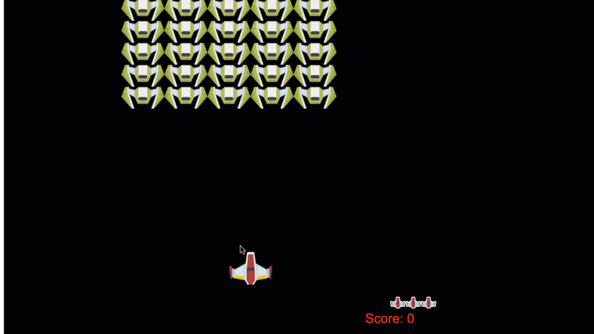
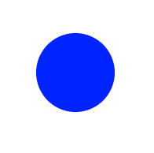
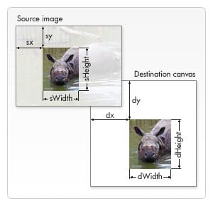

<!--
title:   MicrosoftのWeb開発教材を使ってみた ⑥スペースシューティングゲーム 【Pub-Subパターン/Canvas/衝突検出】
tags:    JavaScript,ゲーム,Canvas,初心者
private: false
-->

# はじめに

**「Web Development For Beginners」**というMicrosoftがGithubに公開している教材についての記事です。

<details><summary> 教材の紹介・選んだ理由など </summary><div>

### この教材を選んだ理由

https://github.com/microsoft/Web-Dev-For-Beginners

- HTML/CSS/JavaScriptを触れるいい感じの教材が欲しかった
    - そこそこのボリュームがあり、作りながら学べるタイプの教材
    - 基礎的なトピックが一通り網羅されている
- 質が高そう
    - なにせあのMicrosoftなので、きっと良いものでしょう。
- 題材が**面白そう**
    - 軽く調べた感じだとチュートリアルでよくある題材として「TODOアプリ」「クイズアプリ」などがあるみたいですが、どれもどう実装するのか想像がついてしまって、余り興味がわきませんでした。
    - しかしこの教材は「テラリウム」「タイピングゲーム」「ブラウザ拡張機能」「スペースゲーム」「銀行プロジェクト」と、面白そうなトピックが並んでいます。

#### +α 実際に取り組んで感じたこと

- 提供されるリファレンス・参考サイトの質が高い
    - 一例は**Flexbox Froggy**。🐸 を並べながら `flexbox` の扱いについて学べるサイトです。超わかりやすいです。

https://flexboxfroggy.com/#ja

- 「アクセシビリティ」「ブラウザがどう動くのか」といった知識も学べる
    - 絶対やるべきだけど後回しにしがちなトピックも結構ガッツリ触れます。
    - かゆいところに手が届く感じ。
- 多分、英語全くわからなくてもなんとかなる
    - ほとんどのレッスンは `translations`というフォルダに日本語訳があります。
    - 最悪全部Deeplに突っ込めばなんとかなります。
- Edge推しがすごい
    - Microsoftの教材なので当然ですが、デモでは基本Edgeが使われます。
- スケッチノートがわかりやすい
    - 一部レッスンは最初にスケッチノートというイラストがあるのですが、それがすごくわかりやすいです。それに可愛い。
    - 扱うトピックについてイラストで視覚的に示してくれるので、どんな内容をやるのかざっくり把握してからレッスンに入ることが出来ます。


 > [microsoft/Web-Dev-For-Beginners/tree/main/1-getting-started-lessons/3-accessibility より](https://github.com/microsoft/Web-Dev-For-Beginners/blob/main/sketchnotes/webdev101-a11y.png)


### 教材の概要

各レッスンに以下の要素が含まれます。

- スケッチノート(オプション)
    - レッスンの概要がわかりやすくまとまったイラスト
- 補足のビデオ(オプション)
- レッスン前の小テスト
    - 簡単なテスト
- ステップバイステップなレッスン
- 知識のチェック
- レッスン後の小テスト
    - 簡単なテスト
- チャレンジ
- 副読本(サイト)
- 復習と自己学習
- 課題

チャレンジ〜は調べ物や課題をこなします。
課題については必要だと思ったものだけやりました。

#### 教材の構成

1. **getting-started-lessons(はじめに)**
    1. プログラミング言語と開発ツール
    1. アクセシビリティ
    1. Githubの基礎
2. **js-basics(JavaScript基礎)**
    2. データ型
    2. 関数とメソッド
    2. 分岐処理
    2. ループ
3. **terrarium（テラリウム構築）**
    3. HTMLイントロ
    3. CSSイントロ
    3. DOM操作とクロージャ
4. **typing-game（タイピングゲーム）**
    4. タイピングゲームを作る(イベント管理)
5. **browser-extension（ブラウザ拡張機能）**
    5. ブラウザについて
    5. API呼び出し、ローカルストレージの利用
    5. バックグラウンドタスクとパフォーマンス
6. **space-game（スペースシューティングゲーム）**
    6. イントロ(Pub-Subパターン)
    6. キャンバス
    6. モーションの追加
    6. レーザー追加、衝突検出
    6. スコアの保存
    6. 終了と再起動
7. **bank-project（架空の銀行プロジェクト）**
    7. WebアプリのHTMLテンプレートとルート
    7. ログインと登録フォームの構築
    7. データの取得と利用方法
    7. 状態管理の概念

### 取り組む際に気をつけたこと

* コピペ/写経にならないようにする
    * サンプルコードと実装の解説が一緒になっているので、理解したつもりになってコピペしがちです。
    * まず一通り目を通してから、なるべく自分の頭で考えて実装するようにしました。
* 全部完璧にやろうとしない
    * 「12週間、24レッスンのカリキュラム」と銘打たれているように、出される課題や副教材を全てこなそうと思うとかなりボリュームがあります。
        * そのため、現時点で必要だと思うカリキュラムにのみ取り組みました。
</div></details>

***

[〜②JavaScript基礎まで【導入/アクセシビリティ/JavaScript の基礎】](2022-02-08_JavaScript_Microsoft_d78514969191491a4bcd.md)
[③テラリウム構築 【HTML・CSS基礎/DOM操作/クロージャ】](2022-02-09_CSS_HTML_JavaScript_59b8e43d8d6fb609c7d5.md)
[④タイピングゲーム 【JavaScriptのイベント処理】](2022-02-09_JavaScript_340f391ee9f167bf4333.md)
[⑤-1ブラウザ拡張機能 【ブラウザの仕組み/拡張機能作成の導入】](2022-02-10_Web_d0189565d039c2c11383.md)
[⑤-2ブラウザ拡張機能 【API/LocalStorage/BackGround/Performance】](https://qiita.com/NasuPanda/items/59434d0841482fcef27d)
**⑥スペースシューティングゲーム【Pub-Subパターン/Canvas/衝突検出】本記事**
⑦架空銀行プロジェクト【ログイン/データ管理/状態管理】

***

### 記事の目的

- 学習のアウトプット
- 教材を使ってみたところかなり良かったので、その紹介

### 注意点

自身の学習のアウトプットがメインなので、理解できているところ(他言語と共通の箇所など)は省いています。
また、課題やtipsについても結構省きます。
この教材に興味を持った方はぜひご自分で取り組んでみてください。

## 6-Space game

https://github.com/microsoft/Web-Dev-For-Beginners/tree/main/6-space-game

スペースシューティングゲームの作成を通して、

- `Canvas`要素と**相互にやりとりして**画面上に物を描く
- 直交座標系を**理解する**
- Pub-Sub パターンを**学び**、メンテナンスや拡張が容易なサウンドゲームアーキテクチャを作成できるようになる
- Async/Await を**活用して**ゲームリソースをロードする
- キーボードイベントを**処理する**



> https://github.com/microsoft/Web-Dev-For-Beginners/tree/main/6-space-gameより

### 学習の目的

- ゲーム構築に備えて、クラスとコンポジションの両方を使った継承と Pub/Sub パターンを学ぶ
- 画面に要素を描画するために使用される Canvas API について
- 直交座標と Canvas API を使用して、要素がどのように動きを得ることができるか見る。
- 要素を衝突させ、キープレスでお互いに反応させ、ゲームのパフォーマンスを確保するためのクールダウン機能を提供する。
- ゲームのステータスや成績に応じて計算を行う
- アセットのクリーンアップや変数値のリセットなど、ゲームの終了と再開について学ぶ

## イントロダクション Pub-Subパターンについて

### ゲーム開発の共通事項・Pub-Subパターンの導入

#### はじめに

プロジェクトの規模が大きくなってくると、アーキテクチャの決定が重要になってくる。
JavaScriptで大規模なアプリケーションを作成するには、大きく分けて「コンポジション」「継承」という2つのアプローチが考えられる。
ここでは、ゲーム開発を例に上げて考えてみる。

#### ゲーム開発の共通事項

ゲームにはゲームオブジェクト=画面上に存在するオブジェクトがある。
これらは直交座標系上に位置しており、xとyの座標を持つことが特徴。

また、ゲームオブジェクトには基本的に全てのゲームに共通する標準的な特性がある。

- Location-based
    - 全てではないにしても、ほとんどのゲーム要素は位置情報に基づく
    - つまり、座標xとyを持つということ
- Movable
    - これらは新しい場所に移動することが出来るオブジェクト
    - プレイヤーやモンスター、NPCなど
    - 木のような静的オブジェクトは別
- Self-destructing
    - 自分自身を削除するために存在する一時的なプロパティ
    - 通常これは `dead` `destroyed` ブール値で表され、このオブジェクトがレンダリングされなくなることをゲームエンジンに通知する
- Cool-down
    - 短命なオブジェクトの典型的なプロパティ
    - 例として、数ミリ秒しか見られない爆発などのグラフィック効果・テキスト


✅ パックマンのようなゲームについて考えてみよう
パックマンはやったことがないのでポケモンで考えてみます。

1. キャラクターの移動操作
2. 移動できるキャラクター、動かせる岩など
3. ひんしになったポケモンは戦闘画面から消える、取ったアイテムは画面から消えるなど
4. 技のエフェクト

### **ゲーム開発における継承・コンポジション**

上で説明したような動作は、クラスやオブジェクトに関連付けられたメソッドとして表現できる。

#### **クラスと継承**

クラスに特定の振る舞いを追加するため、クラスと継承を組み合わせて使う考え方。

##### プロトタイプチェーン

[継承とプロトタイプチェーン - MDN](https://developer.mozilla.org/ja/docs/Web/JavaScript/Inheritance_and_the_prototype_chain)と[こちらの記事](https://qiita.com/howdy39/items/35729490b024ca295d6c)を参照。

JSのオブジェクトはすべて**プロトタイプ**と呼ばれる他のオブジェクトへの内部的なつながりを持っている。
そのプロトタイプオブジェクトも自身の**プロトタイプ**を持っていて、オブジェクトの**プロトタイプ**が `null` に到達する(=プロトタイプチェーンの終端)までそれが続く。

```js
// o というオブジェクトがあり、自身のプロパティとして a と b を持っています。
// {a: 1, b: 2}
// o.[[Prototype]] は b と c プロパティを持っています。
// {b: 3, c: 4}
// 最後に、o.[[Prototype]].[[Prototype]] は null です。
// これがプロトタイプチェーンの終端としての null であり、
// 定義によると、 null は [[Prototype]] を持っていません。
// つまり、プロトタイプチェーン全体は次のようになります。
// {a:1, b:2} ---> {b:3, c:4} ---> null

console.log(o.a); // 1
// o には、自身のプロパティとして 'a' があるでしょうか？はい、その値は1です。

console.log(o.b); // 2
// o には、自身のプロパティとして 'b' があるでしょうか？はい、その値は2です。
// o のプロトタイプにも 'b' プロパティがありますが、アクセスされません。
// これを「property shadowing」と呼びます。

console.log(o.c); // 4
// o には、自身のプロパティとして 'c' があるでしょうか？いいえ、そのプロトタイプを確認します。
// o.[[Prototype]] には、自身のプロパティとして 'c' があるでしょうか？はい、その値は4です。

console.log(o.d); // undefined
// o には、自身のプロパティとして 'd' があるでしょうか？いいえ、そのプロトタイプを確認します。
// o.[[Prototype]] には、自身のプロパティとして 'd' があるでしょうか？いいえ、そのプロトタイプを確認します。
// o.[[Prototype]].[[Prototype]] は null であるため探索を中止し、
// プロパティが見つからなかったため undefined を返します。
```

インスタンスの **`__proto__**`プロパティを見ると、プロパティを大量に持っているオブジェクトであることがわかる。
インスタンスの `__proto__` ＝オブジェクトの `prototype`。


プロトタイプチェーンの仕組み

1. まずは自分のプロパティから存在を調べる
2. なかった場合 `__proto__`の参照先(つまり `Object.prototype`)を調べる
3. それでもなければ `__proto__.__proto__`・・・
4. nullになるまで探索を行う。(プロトタイプチェーンの終端はnull)

##### JavaScriptの継承

全てのインスタンスは参照先オブジェクトのプロトタイプを**継承**している。
例 : ArrayインスタンスならArray.prototypeを継承。
JavaScriptの継承はプロトタイプチェーンとプロトタイプの継承という仕組みのこと。

コードで表現すると簡単なゲームオブジェクトは次のようになる。

```js
//GameObject クラスを設定します。
class GameObject {
  constructor(x, y, type) {
    this.x = x;
    this.y = y;
    this.type = type;
  }
}

//このクラスは GameObject の固有のクラスプロパティを拡張します。
class Movable extends GameObject {
  constructor(x,y, type) {
    super(x,y, type)
  }

//この移動可能なオブジェクトは、画面上で移動することができます。
  moveTo(x, y) {
    this.x = x;
    this.y = y;
  }
}

//これは Movable クラスを拡張した特定のクラスで、継承しているすべてのプロパティを利用することができます。
class Hero extends Movable {
  constructor(x,y) {
    super(x,y, 'Hero')
  }
}

//一方、このクラスは GameObject のプロパティのみを継承しています。
class Tree extends GameObject {
  constructor(x,y) {
    super(x,y, 'Tree')
  }
}

//hero は動くことができます
const hero = new Hero();
hero.moveTo(5,5);

//しかし木にはできません
const tree = new Tree();
```

#### extends is 何

[extends - MDN](https://developer.mozilla.org/ja/docs/Web/JavaScript/Reference/Classes/extends)

クラス宣言の中で他のクラスの小クラスを生成するために使用する。
要するにクラスの継承を行う。
`constructor` 内で `super` を使うことで親クラスの `constructor` にアクセス可能。

### **コンポジション**

あるクラスから別の機能を扱う方法として、継承以外にコンポジションを使用する方法がある。
コンポジションとは、構成、混合物などを意味する単語。

オブジェクトは次のような動作をする。

```js
//定数の gameObject を作成する
const gameObject = {
  x: 0,
  y: 0,
  type: ''
};

//そして定数の movable
const movable = {
  moveTo(x, y) {
    this.x = x;
    this.y = y;
  }
}
//そして、定数 movableObject は定数 gameObject と movable で構成されます。
const movableObject = {...gameObject, ...movable};

//次に、movableObject のプロパティを継承する新しい Hero を作成する関数を作成します。
function createHero(x, y) {
  return {
    ...movableObject,
    x,
    y,
    type: 'Hero'
  }
}
//...そして gameObject プロパティのみを継承する静的オブジェクト。
function createStatic(x, y, type) {
  return {
    ...gameObject
    x,
    y,
    type
  }
}
//hero を作って動かします
const hero = createHero(10,10);
hero.moveTo(5,5);
//そして、周りに立つだけの木を作ります
const tree = createStatic(0,0, 'Tree');
```

### 継承とコンポジション、何が違う？

**参考記事**

- [継承とコンポジションをどう使い分けるか](https://4geek.net/difference-between-inheritance-and-composition/)
- [コンポジションとは:JavaA2Z](http://www.kab-studio.biz/Programing/JavaA2Z/Word/00000432.html#:~:text=%E3%81%82%E3%82%8B%E3%82%AF%E3%83%A9%E3%82%B9%E3%81%AE%E6%A9%9F%E8%83%BD%E3%82%92,%E3%82%92%E7%B5%84%E3%81%BF%E8%BE%BC%E3%82%80%E3%81%93%E3%81%A8%E3%81%8C%E3%81%A7%E3%81%8D%E3%82%8B%E3%80%82)

#### 継承

* **is-a関係** AはBである関係を表す
* 小クラス=親クラスの関係の時に使う

#### コンポジション

* **has-a関係** AはBを含む関係を表す
* 他のクラスを所有することにより他のクラスの機能を利用する
* 単純に機能を持たせたい・機能を拡張したい場合に使う

### **Pub/Subパターン**

`publish-subscribe`の略(発行-購読)。
ゲーム開発におけるアーキテクチャの一種。

このパターンは、アプリケーションを構成するコンポーネントが他のコンポーネントを知ってはいけないという考えを示している。
(=疎結合を意識するということ？)

様々な部分が分離されていると、以下のようなメリットがある。

- 何が起こっているのかを見るのが簡単になる。
- 必要に応じて突然動作を変えるといったことが容易になる。


以下の要素で構成される。

- Message
    - 通常、オプションのペイロード(メッセージの内容を明確にするデータ)を持ったテキスト文字列
    - 典型的なメッセージは「KEY_PRESSED_ENTER」など。
- Publisher
    - メッセージを発行し、全ての購読者に送信する
- Subscriber
    - 特定のメッセージを待ち受け、メッセージを受信した結果としてレーザを発射するなどのタスクを実行する

#### 実装

```js
//リスナーを含む EventEmitter クラスを設定します。
class EventEmitter {
  constructor() {
    this.listeners = {};
  }
//メッセージを受信したときに、リスナーにそのペイロードを処理させます。
  on(message, listener) {
    if (!this.listeners[message]) {
      this.listeners[message] = [];
    }
    this.listeners[message].push(listener);
  }
// メッセージを送るとき、リスナーにペイロードとともに送ります。
  emit(message, payload = null) {
    if (this.listeners[message]) {
      this.listeners[message].forEach(l => l(message, payload))
    }
  }
}
```

**`emit`** 発する、放出するなど。`EventEmitter`=イベントを発火する、というイメージでしょうか。

上記のコードを使用した実装

```js
//メッセージ構造を設定します
const Messages = {
  HERO_MOVE_LEFT: 'HERO_MOVE_LEFT'
};
//上記で設定した EventEmitter を呼び出します。
const eventEmitter = new EventEmitter();
//hero を設定します。
const hero = createHero(0,0);
//イベント送信者に hero が左に移動するメッセージを監視することを知らせ、それに基づいて行動するようにします。
eventEmitter.on(Messages.HERO_MOVE_LEFT, () => {
  hero.move(5,0);
});

//keyup イベントを監視するためにウィンドウを設定し、具体的には左矢印が押下された場合、hero を左に移動するためのメッセージを発します。
window.addEventListener('keyup', (evt) => {
  if (evt.key === 'ArrowLeft') {
    eventEmitter.emit(Messages.HERO_MOVE_LEFT)
  }
});
```

上のコードではキーボードイベント `ArrowLeft` を利用して `HERO_MOVE_LEFT` メッセージを送信している。そのメッセージを受け取り、結果として `hero` を移動させている。

このパターンの強みは**イベントリスナー**と**ヒーロー**が互いのことを知らないこと。

つまり、 `ArrowLeft` を `A` キーに割り当てることも出来るし、 `eventEmitter.on` に編集を加えれば `AllowLeft` で全く異なることが可能になる。

ゲームの規模が大きくなり、より機能が複雑になったとしても、このパターンは同じままなので、コードをクリーンに保つことが出来る。

### 副教材

[Microsoft Pub-Subパターン](https://docs.microsoft.com/ja-jp/azure/architecture/patterns/publisher-subscriber?WT.mc_id=academic-13441-cxa)

#### どんな時に使うか

クラウドベースの分散アプリケーションなど。
システムのコンポーネントは多くの場合、イベントが発生した時に他のコンポーネントに情報を提供する必要がある。

そこで、Pub-Subパターンを導入する。

#### 構成

パブリッシャー → **入力CH** → メッセージブローカー → **出力CH** → サブスクライバー

- 送信者がメッセージ内にイベントをパッケージ化、入力チャンネルを介して送信
- サブスクライバー(コンシューマ)ごとに1つの出力チャンネルを持つ
- そのメッセージを受け取りたい全てのサブスクライバーのために、入力チャネルから出力チャネルに各メッセージをコピーするためのメカニズムが必要。 この操作は通常、メッセージブローカー・イベントバスなどの仲介機能によって処理される。

要するにイベントの通知⇔イベントの実行に入出力チャンネルを介することで、疎結合にして拡張性・再利用性を高めよう、という感じでしょうか。

#### **Pub-Subパターンを使用する状況**

> 適している状況

> アプリケーションは、非常に多くのコンシューマーに情報をブロードキャストする必要があります。
> アプリケーションは、独立して開発された 1 つまたは複数のアプリケーションまたはサービスと通信する必要があります。これらは、異なるプラットフォーム、プログラミング言語、および通信プロトコルを使用している可能性があります。
> アプリケーションは、コンシューマーからのリアルタイムの応答を必要とせずに、コンシューマーに情報を送信できます。
> 統合されようとしているシステムは、データの最終的整合性モデルをサポートするように設計されています。
> アプリケーションは、複数のコンシューマーに情報を通信する必要がありますが、これらには、送信者とは異なる可用性要件や稼働スケジュールがある場合もあります。

> このパターンが適さない状況

> 作成側アプリケーションの大きく異なる情報を必要とするコンシューマーが、数人だけしかいない場合。
> アプリケーションが、ほぼリアルタイムのコンシューマーとの対話を必要とする場合。

## Canvasの利用

CanvasはHTML要素。JavaScriptから操作することで色々と描画することが出来る。
[Canvas API - MDN](https://developer.mozilla.org/ja/docs/Web/API/Canvas_API)

### 基本的な使い方

1. canvas要素への参照
2. `getContext` コンテキストを`2d`に設定
3. 描画は [CanvasRenderingContext2D](https://developer.mozilla.org/ja/docs/Web/API/CanvasRenderingContext2D) インターフェースを用いて行われる

```js
const canvas = document.getElementById('canvas');
const ctx = canvas.getContext('2d');

ctx.fillStyle = 'green';
ctx.fillRect(10, 10, 150, 100);
```

- HTMLでは `<canvas id="myCanvas" width="200" height="100"></canvas>` のように宣言される。
    - width : 横幅
    - height : 縦幅
- 何がどこにあるのか表現するためにx, y座標を使う。
    - 左上が (0, 0)なので注意


> [MDN](https://developer.mozilla.org/ja/docs/Web/API/Canvas_API/Tutorial/Drawing_shapes) より

- Canvasを使うと以下のようなものが書ける。
    - 幾何学的な図形
    - テキスト
    - 画像( `.png`,  `.jpg`などに基づく)
- 3Dの図形を描画したい時は[WebGL](https://developer.mozilla.org/ja/docs/Web/API/WebGL_API)を使うと良い。

#### 丸を書いてみる

[canvasに図形を描く - MDN](https://developer.mozilla.org/ja/docs/Web/API/Canvas_API/Tutorial/Drawing_shapes#drawing_paths)

1. `Path`を作成
2. `fillStyle`などの設定
3. パスへ描画するためのコマンドを使用
4. `stroke` または `fill`で描画

```html
<html>
    <body>
        <canvas id="canvas" width="200" height="200"></canvas>
        <script src="index.js"></script>
    </body>
</html>
```

```js
const canvas = document.getElementById('canvas');
const ctx = canvas.getContext('2d');

// 始めに、パスを作成します。
ctx.beginPath();
ctx.fillStyle = "blue"
// 次に、パスへ描画するために描画コマンドを使用します。
// x, y, 半径, 開始角度, 終了角度, 方向(デフォルトは時計回り)
ctx.arc(100, 100, 50, 0, 2 * Math.PI);
// パスが作成されたら、描画するための stroke または fill を実行できます。
ctx.fill();
```



OK。

### 画像の読み込みと描画

* `Image` オブジェクトを作成
* `src` を設定
* 画像のロードイベントを待つ

```js
const img = new Image();
img.src = 'path/to/my/image.png';
img.onload = () => {
  // イメージが読み込まれて使用可能な状態
}
```

使用イメージ

```js
function loadAsset(path) {
  return new Promise((resolve) => {
    const img = new Image();
    img.src = path;
    img.onload = () => {
      // イメージが読み込まれて使用可能な状態
      resolve(img);
    }
  })
}

// 使い回す
async function run() {
  const heroImg = await loadAsset('hero.png')
  const monsterImg = await loadAsset('monster.png')
}
```

画面に描画する

```js
async function run() {
  const heroImg = await loadAsset('hero.png')
  const monsterImg = await loadAsset('monster.png')

  canvas = document.getElementById("myCanvas");
  ctx = canvas.getContext("2d");
  ctx.drawImage(heroImg, canvas.width/2, canvas.height/2);
  ctx.drawImage(monsterImg, 0, 0);
}
```

`drawImage` の引数はこんな感じ。

```js
ctx.drawImage(image, dx, dy);
ctx.drawImage(image, dx, dy, dWidth, dHeight);
ctx.drawImage(image, sx, sy, sWidth, sHeight, dx, dy, dWidth, dHeight);
```



> [CanvasRenderingContext2D.drawImage()](https://developer.mozilla.org/en-US/docs/Web/API/CanvasRenderingContext2D/drawImage) より


### ゲームの実装

#### 何を構築するか

- Canvas要素を使ってWebページを作成。
- 黒いバックグラウンド `1024*768` をレンダリングする。
- プレイヤー/エネミーの描画

プレイヤーの宇宙船

5×5のエネミー


> 画像参照元 [Microsoft Web-Dev-For-Geginners/6-space-game/2-drawing-to-canvas](https://github.com/microsoft/Web-Dev-For-Beginners/blob/main/6-space-game/2-drawing-to-canvas/translations/README.ja.md#%E4%BD%95%E3%82%92%E6%A7%8B%E7%AF%89%E3%81%99%E3%82%8B%E3%81%8B)]

* `npm`のコマンドを使ってローカルサーバ(http://localhost:5000)を立ち上げたいので、`npm` `Node` を[インストール](https://docs.npmjs.com/getting-started)する必要がある。

スタート時点のコード

```js
function loadTexture(path) {
  return new Promise((resolve) => {
    const img = new Image()
    img.src = path
    // 画像ロード待ち
    img.onload = () => {
      resolve(img)
    }
  })
}

function createEnemies(ctx, canvas, enemyImg) {
  // TODO draw enemies
}

window.onload = async () => {
  canvas = document.getElementById('canvas');
  ctx = canvas.getContext('2d');
  // TODO load textures

  // TODO draw black background
  // TODO draw hero
  // TODO uncomment the next line when you add enemies to screen
  //createEnemies(ctx, canvas, enemyImg);
}
```

1. 黒のバックグラウンドキャンバスを描画

```js
// TODO draw black background
ctx.fillStyle = "black";
ctx.fillRect(0, 0 ,canvas.width, canvas.height);
```

2. テクスチャの読み込み

```js
// TODO load textures
const heroImg = await loadTexture("./assets/player.png")
const enemyImg = await loadTexture("./assets/enemyShip.png")
```

3. 下半分の画面中央にプレイヤーを描画

```js
// TODO draw hero
ctx.drawImage(heroImg, canvas.width / 2 - 45, canvas.height - canvas.height / 4);
```

4. 5×5のモンスターを描画

```js
// TODO uncomment the next line when you add enemies to screen
createEnemies(ctx, canvas, enemyImg);
```

```js
function createEnemies(ctx, canvas, enemyImg) {
  // TODO draw enemies
  const MONSTER_TOTAL = 5;
  const MONSTER_WIDTH = MONSTER_TOTAL * 98;
	// モンスターが中心になるように座標設定
  const START_X = (canvas.width - MONSTER_WIDTH) / 2;
  const STOP_X = START_X + MONSTER_WIDTH;

  for (let x = START_X; x < STOP_X; x += 98) {
    for (let y = 0; y < 50 * 5; y += 50) {
      ctx.drawImage(enemyImg, x, y);
    }
  }
}
```

結果

OK。

### 副教材

今後使う機会があればその時に。

- [Canvasチュートリアル](https://developer.mozilla.org/ja/docs/Web/API/Canvas_API/Tutorial)
- [WebGLチュートリアル](https://developer.mozilla.org/ja/docs/Web/API/WebGL_API/Tutorial)

## モーションの追加

ゲームにモーションを追加していく。以下のようなイベント発生時にモーションが発生するようにする。

- **キーボード/マウスの動き** ユーザがキーボードやマウスを操作してオブジェクトを動かした時
- **ゲームで誘導する動き** ゲームが一定の時間間隔でオブジェクトを移動させる

**流れ**

1. オブジェクトの新しい位置を設定
2. 画面をクリア(背景色で塗りつぶす短形を描く)
3. 再度描画

コードで表すとこんな感じ。

```js
// hero の場所を決めます。
hero.x += 5;
// canvasの長方形をクリアします。
ctx.clearRect(0, 0, canvas.width, canvas.height);
// ゲームの背景と hero 描画し直します。
ctx.fillRect(0, 0, canvas.width, canvas.height)
ctx.fillStyle = "black";
ctx.drawImage(heroImg, hero.x, hero.y);
```

ただし、この方法はパフォーマンス的によろしくない。(変更のない箇所まで再レンダリングしている など)

そのため、通常は以下のような[代替案](https://www.html5rocks.com/ja/tutorials/canvas/performance/)を取ることでパフォーマンスを改善する。

- 画面領域外のcanvasに**プリレンダリング**する
    - 別で用意したcanvasに一時的な画像をレンダリングしておき、そのcanvasを可視領域にレンダリングすること。
    - ディスプレイリストとも呼ばれる。
- canvasを一括して呼び出す
    - 例えば複数の線を描画するときには、個別に描画するよりもすべての線を含むパスを1つ作成しておき、1回の呼び出しでそのパスを描画すると効率が上がる。
- canvasの状態を不必要に変更しない
- 画面の差分のみをレンダリングする

### キーボードイベントの処理

ユーザがゲームを操作しようと思った場合、主にキーボード・クリックという2つの選択肢がある。

- **キーボードイベント**はウィンドウ全体でトリガーされる
- **クリックイベント**は特定の要素のクリックに接続することが出来る

今回のようなプロジェクトではキーボードイベントが適している。

キーボードイベントの例

```js
window.addEventListener('keyup', (evt) => {
  // `evt.key` = キーの文字列表現
  if (evt.key === 'ArrowUp') {
    // 何か処理をします。
  }
})
```

- `key` 押されたキーの文字列、例えば `ArrowUp`
- `keyCode` 数値表現。例えば `37` は `ArrowLeft` に対応

なお、紹介されている `keyCode` ですが、↓の記事やMDNを見てみたところ現在は非推奨のようです。

- **[JavaScriptのキーボードイベント、キー判定にどれつかう？](https://qiita.com/riversun/items/3ff4f5ecf5c21b0548a4)**
- [KeyboardEvent.keyCode](https://developer.mozilla.org/ja/docs/Web/API/KeyboardEvent/keyCode)

[代わりにKeyboardEvent.Code](https://developer.mozilla.org/ja/docs/Web/API/KeyboardEvent/code)を使うべきとのこと。

`key` / `code` については好みで良さそう？使い分けるような場面があるんでしょうか。

#### 注意点 特殊なキー

ウィンドウに影響を与える特殊なキーがある。

- 矢印キー
- スペースキー

これらに対応するブラウザの動作は無効化しておく。

```js
let onKeyDown = function (e) {
  console.log(e.keyCode);
  switch (e.keyCode) {
    case 37:
    case 39:
    case 38:
    case 40: // 矢印キー
    case 32: // スペース
      e.preventDefault();
      break;
    default:
      break; // 他のキーをブロックしない。
  }
};

window.addEventListener('keydown', onKeyDown);
```

- `e.preventDefault()` でデフォルトの動作を無効にする。
- 地味に`switch` は初出なので一応調べておきます。
    - [switch - MDN](https://developer.mozilla.org/ja/docs/Web/JavaScript/Reference/Statements/switch)
    - 入力の結果と評価される値が等しい最初の`case` 節を(===を使用して)探し、その節のコードを実行
    - 一致する `case` 節が見つからなければ `default` 節を探し、見つかればその節に制御を移す
    - `break` を省略すると、 `switch` 内の次の文から実行を継続する

### ゲームで誘導された動き

`setTimeout` や `setInterval` のようなタイマーを使うことでオブジェクトの位置を時間間隔ごとに更新することが出来る。

コードで表すと以下のようになる。

```js
let id = setInterval(() => {
  // 敵をY軸で動かす
	enemy.y += 10;
})
```

### ゲームループ

- 一定の間隔で呼び出される関数
- ユーザに見えるべきものはすべてループにより描画され、更新され続ける

コードで表すと以下のようになる。

```js
// 200msごとにcanvasの再描画
let gameLoopId = setInterval(() =>
  function gameLoop() {
    ctx.clearRect(0, 0, canvas.width, canvas.height);
    ctx.fillStyle = "black";
    ctx.fillRect(0, 0, canvas.width, canvas.height);
    drawHero();
    drawEnemies();
    drawStaticObjects();
}, 200);
```

### スペースゲーム実装の続き

- **プレイヤーの移動** 矢印キーを使って移動できるようにする
- **敵の移動** 与えられたルート上で移動する

1. **プレイヤー、エネミーのオブジェクト及びその親となるオブジェクトを追加。**
    - xとyのプロパティを持っている必要がある
    - 自身をcanvasに描画する機能を持つ必要がある

  ```js
  class GameObject {
    constructor(x, y) {
      this.x = x;
      this.y = y;
      this.dead = false;
      this.type = "";
      this.width = 0;
      this.height = 0;
      this.img = undefined;
    }

    draw(ctx) {
      ctx.drawImage(this.img, this.x, this.y, this.width, this.height);
    }
  }
  ```

  ```js
  class Hero extends GameObject {
    constructor(x, y) {
      // ...x, y, type, speedが必要です。
      // 以下追加分
      super(x, y);
      this.type = "Hero";
      (this.width = 99), (this.height = 75);
      this.type = 'Hero';
      // speed は 0
      this.speed = { x: 0, y: 0 };
    }
  }
  class Enemy extends GameObject {
    constructor(x, y) {
      super(x, y);
      (this.width = 98), (this.height = 50);
      this.type = "Enemy";
      let id = setInterval(() => {
        if (this.y < canvas.height - this.height) {
          this.y += 5;
        } else {
          console.log('Stopped at', this.y)
          clearInterval(id);
        }
      }, 300)
    }
  }
  ```

  - `(this.width = 98), (this.height = 50);`
      - （）は何？

      ```bash
      > let a=10
      > let b=20

      > (a=100,b=200)
      # a=100,b=200になってる

      > a=10000,b=3000
      # a=1000,b=2000になってる
      ```

      - 普通の `,` 区切りと一緒？わかりやすくするため？
  - `let id = setInterval()`
      - [setInterval() - MDN](https://developer.mozilla.org/ja/docs/Web/API/setInterval)
      - 引数
          - 実行したい関数。関数には引数が渡されず、返り値を想定していない。
          - 遅延をミリ秒単位で指定できる。
      - 返り値
          - 返り値 `intervalID` は、作成したタイマーを識別するための正の整数値。
          - この値はインターバルのキャンセルのために `clearInterval` に渡すことが出来る。

2. **プレイヤーを動かすためのキーイベントハンドラ追加**
    - 左上が(0,0)
    - デフォルトの動作を止めること

  ```js
  let onKeyDown = function (e) {
    console.log(e.keyCode);
      // ...デフォルトの動作を止めるようにコードを追加してください
      // 以下追加分
    switch (e.keyCode) {
      case 37:
      case 39:
      case 38:
      case 40: // 矢印キー
      case 32: // スペース
        e.preventDefault();
        break;
      default:
        break;
    }
  };

  window.addEventListener("keydown", onKeyDown);
  ```

3. **Pub-Subパターンの実装**

 - **ウィンドウにイベントリスナーを追加**

 ```js
 window.addEventListener("keyup", (evt) => {
    if (evt.key === "ArrowUp") {
      eventEmitter.emit(Messages.KEY_EVENT_UP);
    } else if (evt.key === "ArrowDown") {
      eventEmitter.emit(Messages.KEY_EVENT_DOWN);
    } else if (evt.key === "ArrowLeft") {
      eventEmitter.emit(Messages.KEY_EVENT_LEFT);
    } else if (evt.key === "ArrowRight") {
      eventEmitter.emit(Messages.KEY_EVENT_RIGHT);
    }
  });
 ```

 - `keyup`時にメッセージを発行(=処理の実行)
 - `keyup` / `keydown`
     - `keyup` はキーを押して**離した時**に発火
     - `keydown` はキーを**押した時**に発火
     - `keydown` でデフォルトのイベントを防ぎつつ、 `keyup` でプレイヤーを操作できるようにしている。

 **EventEmitterクラス作成**

 ```js
 class EventEmitter {
   constructor() {
     this.listeners = {};
   }

   on(message, listener) {
     if (!this.listeners[message]) {
       this.listeners[message] = [];
     }
     this.listeners[message].push(listener);
   }
 
   emit(message, payload = null) {
     if (this.listeners[message]) {
       this.listeners[message].forEach((l) => l(message, payload));
     }
   }
 }
 ```
 
 - EventEmitterって何してる？
   - 実行したいイベント⇔メッセージの紐付け(on)
   - 引数はメッセージ・コールバック関数
   - メッセージ経由でイベントを発火する(emit)
   - 引数はメッセージ・オプションのペイロード (メッセージの内容を明確にするデータ)の2つを定義している。
 
 それぞれの中身をもう少し詳しく見ていきます。
 
 - `on`
     - `listeners`の中にメッセージに対応する配列を作り、その中にイベントを追加していく。
     - 配列を使うのはおそらく1つのメッセージに対して複数のイベントを登録できるようにするため。
     - 渡されたメッセージに対応するイベントの配列がなければ初期化する。
 - `emit`
     - 渡されたメッセージに対応する配列があれば、`forEach`で呼び出して順次処理する。
     - `forEach`の引数は関数。ブロック`{}`が省略されている。
     - `forEach(l => l(message, payload))` このようにアロー関数では引数の()も省略できる。
 - `EventEmitter`という `message` (主にユーザ操作により発生するイベント)⇔ `event`(実行したい処理)のインターフェースとなるクラスを用意することで、呼び出し/処理を分離させることができていますね。
 
 - **定数を追加、EventEmitterを設定**
 
 ```js
 const Messages = {
   KEY_EVENT_UP: "KEY_EVENT_UP",
   KEY_EVENT_DOWN: "KEY_EVENT_DOWN",
   KEY_EVENT_LEFT: "KEY_EVENT_LEFT",
   KEY_EVENT_RIGHT: "KEY_EVENT_RIGHT",
 };
 
 let heroImg, 
     enemyImg, 
     laserImg,
     canvas, ctx, 
     gameObjects = [], 
     hero, 
     eventEmitter = new EventEmitter();
 ```
 
 - **ゲームを初期化**
 
 ```js
 function initGame() {
   gameObjects = [];
   createEnemies();
   createHero();
 
   eventEmitter.on(Messages.KEY_EVENT_UP, () => {
     hero.y -=5 ;
   })
 
   eventEmitter.on(Messages.KEY_EVENT_DOWN, () => {
     hero.y += 5;
   });
 
   eventEmitter.on(Messages.KEY_EVENT_LEFT, () => {
     hero.x -= 5;
   });
 
   eventEmitter.on(Messages.KEY_EVENT_RIGHT, () => {
     hero.x += 5;
   });
 }
 ```
 
4. **ゲームループ設定**

```js
window.onload = async () => {
  canvas = document.getElementById("canvas");
  ctx = canvas.getContext("2d");
  heroImg = await loadTexture("assets/player.png");
  enemyImg = await loadTexture("assets/enemyShip.png");
  laserImg = await loadTexture("assets/laserRed.png");

  initGame();
  let gameLoopId = setInterval(() => {
    ctx.clearRect(0, 0, canvas.width, canvas.height);
    ctx.fillStyle = "black";
    ctx.fillRect(0, 0, canvas.width, canvas.height);
    drawGameObjects(ctx);
  }, 100)
};
```

- loadイベントは指定されたリソース(ここではwindow)の読み込みが完了したときに発行される
    - キャンバスの用意、画像の読み込み、ゲームの初期化、ゲームループの設定を行っている

5. **一定間隔で敵を移動させるコードの追加**
 - **`createEnemies()` をリファクタリング、GameObjectsにプッシュ**

 ```js
 function createEnemies() {
   const MONSTER_TOTAL = 5;
   const MONSTER_WIDTH = MONSTER_TOTAL * 98;
   const START_X = (canvas.width - MONSTER_WIDTH) / 2;
   const STOP_X = START_X + MONSTER_WIDTH;

   for (let x = START_X; x < STOP_X; x += 98) {
     for (let y = 0; y < 50 * 5; y += 50) {
       const enemy = new Enemy(x, y);
       enemy.img = enemyImg;
       gameObjects.push(enemy);
     }
   }
 }
 ```

 - **プレイヤーにも同様の処理**

 ```js
 function createHero() {
   hero = new Hero(
     canvas.width / 2 - 45,
     canvas.height - canvas.height / 4
   );
   hero.img = heroImg;
   gameObjects.push(hero);
 }
 ```

 - **描画の開始**
     - `GameObject` から `draw` を継承しているので、それを呼び出す

 ```js
 function drawGameObjects(ctx) {
   gameObjects.forEach(go => go.draw(ctx));
 }
 ```

完成


### 課題

> ゲームフォルダ内の現在の /app.js ファイルに目を通し、コメントを付けて片付ける方法を見つけてください。コードはいとも簡単に制御不能になります。今はコメントを追加して、後で使えるように読みやすいコードにする良い機会です。

コメントを付けるなどして処理をわかりやすくしろ。とのことです。
せっかくなのでJavaScriptのドキュメント規約について少し調べてみます。

- [JSDocリファレンス](https://www.typescriptlang.org/ja/docs/handbook/jsdoc-supported-types.html)
- [JSDocManual](https://sites.google.com/site/jsdoc3manualjp/annotation)

こんな感じでしょうか。間違いがあるかもしれませんが・・・

```js
/**
* ここに関数の説明を書く。
*
* @param {string} name - 名前の指定
* @param {number} [age=null] - 年齢の指定。省略可能。
* @return {string} - 得られた情報の文字列
*/
function hoge(name, age=null) {
  return (!age) ? name : `${name} is ${age}`
}
```

```js
/**
  * 全てのオブジェクトの元となるクラス。
  *
  * @class
  */
class GameObject {
  /**
  * x座標とy座標を初期化する。
  *
  * @param {number} x - 初期のx座標
  * @param {number} y - 初期のy座標
  */
  constructor(x, y) {
    this.x = x;
    this.y = y;
    // 別の場所で設定されるような場合
    /** @type {boolean} */
    this.dead = false;

    // 以下省略
```

今回の規模で細かく書きすぎるとむしろわかりにくくなりそうなので、必要だと思ったところだけ書いていきます。

やったこと

- ↑を参考に注釈を書く
- バラバラだった順序をそれとなく整える
- [on〇〇](https://developer.mozilla.org/ja/docs/Web/API/GlobalEventHandlers)と混在していたので `addEventListener`で統一

```js
/**
  * メッセージの発行・購読を行うクラス
  * @class
  */
  class EventEmitter {
  /** リスナー関数リストの初期化 */
  constructor() {
    this.listeners = {};
  }
  /**
    * メッセージと実行したいイベントを紐付ける。
    *
    * @param {string} message - 対象のメッセージ
    * @param {function} listener - 対象のリスナー関数
    */
  on(message, listener) {
    if (!this.listeners[message]) {
      // 渡されたメッセージに対応する配列が無ければ初期化
      this.listeners[message] = [];
    }
    this.listeners[message].push(listener);
  }
  /**
    * 受け取ったメッセージと紐付けられたイベントを実行。
    *
    * @param {string} message - 対象のメッセージ
    * @param {string} [payload=null] - オプションのペイロード
    */
  emit(message, payload = null) {
    if (this.listeners[message]) {
      this.listeners[message].forEach(listener => listener(message, payload));
    }
  }
}

const Messages = {
  KEY_EVENT_UP: "KEY_EVENT_UP",
  KEY_EVENT_DOWN: "KEY_EVENT_DOWN",
  KEY_EVENT_LEFT: "KEY_EVENT_LEFT",
  KEY_EVENT_RIGHT: "KEY_EVENT_RIGHT",
};

/**
  * 全てのオブジェクトの元となるクラス。
  * @class
  */
class GameObject {
  /**
  * x座標とy座標を初期化する。
  *
  * @param {number} x - 初期のx座標
  * @param {number} y - 初期のy座標
  */
  constructor(x, y) {
    this.x = x;
    this.y = y;
    this.dead = false;
    this.type = "";
    this.width = 0;
    this.height = 0;
    this.img = undefined;
  }
  /** オブジェクトを描画する。*/
  draw(ctx) {
    ctx.drawImage(this.img, this.x, this.y, this.width, this.height);
  }
}

/**
  * GameObjectを継承したヒーロークラス。
  * @extends {GameObject}
  */
class Hero extends GameObject {
  /**
  * x座標とy座標を初期化する。
  *
  * @param {number} x - 初期のx座標
  * @param {number} y - 初期のy座標
  */
  constructor(x, y) {
    super(x, y);
    this.type = "Hero";
    (this.width = 99), (this.height = 75);
    // speed は 0
    this.speed = { x: 0, y: 0 };
  }
}

/**
  * GameObjectを継承したエネミークラス。
  * @extends {GameObject}
  */
class Enemy extends GameObject {
  /**
  * x座標とy座標を初期化する。
  *
  * @param {number} x - 初期のx座標
  * @param {number} y - 初期のy座標
  */
  constructor(x, y) {
    super(x, y);
    (this.width = 98), (this.height = 50);
    this.type = "Enemy";
    // 返り値はタイマー識別用のID
    let intervalID = setInterval(() => {
      if (this.y < canvas.height - this.height) {
        this.y += 5;
      } else {
        console.log('Stopped at', this.y)
        // IDを用いてインターバルをクリア
        clearInterval(intervalID);
      }
    }, 300)
  }
}

/** ヒーローの初期位置・画像を設定する。*/
function createHero() {
  hero = new Hero(
    canvas.width / 2 - 45,
    canvas.height - canvas.height / 4
  );
  hero.img = heroImg;
  gameObjects.push(hero);
}

/** エネミーの初期位置・画像を設定する。*/
function createEnemies() {
  const MONSTER_TOTAL = 5;
  const MONSTER_WIDTH = MONSTER_TOTAL * 98;
  const START_X = (canvas.width - MONSTER_WIDTH) / 2;
  const STOP_X = START_X + MONSTER_WIDTH;

  for (let x = START_X; x < STOP_X; x += 98) {
    for (let y = 0; y < 50 * 5; y += 50) {
      const enemy = new Enemy(x, y);
      enemy.img = enemyImg;
      gameObjects.push(enemy);
    }
  }
}

/** keyDown時にブラウザのデフォルト動作を防ぐ。*/
let onKeyDown = e => {
  console.log(e.keyCode);
  switch (e.keyCode) {
    // 矢印キー
    case 37:
    case 39:
    case 38:
    case 40:
    // スペース
    case 32:
      e.preventDefault();
      break;
    default:
      break;
  }
};

/**  keyUp時にプレイヤーを移動させる。*/
let onKeyUp = e => {
  if (e.key === "ArrowUp") {
    // keyupイベント時にメッセージ発行
    eventEmitter.emit(Messages.KEY_EVENT_UP);
  } else if (e.key === "ArrowDown") {
    eventEmitter.emit(Messages.KEY_EVENT_DOWN);
  } else if (e.key === "ArrowLeft") {
    eventEmitter.emit(Messages.KEY_EVENT_LEFT);
  } else if (e.key === "ArrowRight") {
    eventEmitter.emit(Messages.KEY_EVENT_RIGHT);
  }
}

/** 画像をロードする。 */
function loadTexture(path) {
  return new Promise((resolve) => {
    const img = new Image();
    img.src = path;
    img.onload = () => {
      resolve(img);
    };
  });
}

/** ゲームオブジェクトを描画する。 */
function drawGameObjects(ctx) {
  gameObjects.forEach(go => go.draw(ctx));
}

/** ゲームを初期化する。 */
function initGame() {
    gameObjects = [];
    createEnemies();
    createHero();

    eventEmitter.on(Messages.KEY_EVENT_UP, () => {
      hero.y -=5 ;
    })

    eventEmitter.on(Messages.KEY_EVENT_DOWN, () => {
      hero.y += 5;
    });

    eventEmitter.on(Messages.KEY_EVENT_LEFT, () => {
      hero.x -= 5;
    });

    eventEmitter.on(Messages.KEY_EVENT_RIGHT, () => {
      hero.x += 5;
    });
}

/** メインのゲームループ。 */
let onLoad = async () => {
  canvas = document.getElementById("canvas");
  ctx = canvas.getContext("2d");
  heroImg = await loadTexture("assets/player.png");
  enemyImg = await loadTexture("assets/enemyShip.png");
  laserImg = await loadTexture("assets/laserRed.png");

  initGame();
  let gameLoopId = setInterval(() => {
    ctx.clearRect(0, 0, canvas.width, canvas.height);
    ctx.fillStyle = "black";
    ctx.fillRect(0, 0, canvas.width, canvas.height);
    drawGameObjects(ctx);
  }, 100)
};

let heroImg,
    enemyImg,
    laserImg,
    canvas, ctx,
    gameObjects = [],
    hero,
    eventEmitter = new EventEmitter();

window.addEventListener("keydown", onKeyDown);
window.addEventListener("keyup", onKeyUp);
window.addEventListener("load", onLoad);
```

### 副教材

- Javascriptを使った[ゲーム開発用のcanvasフレームワーク](https://github.com/collections/javascript-game-engines)