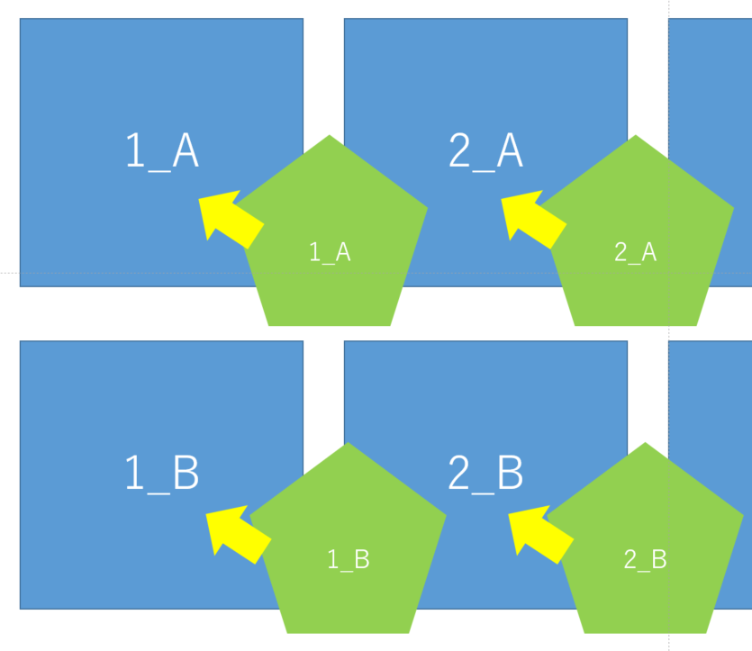
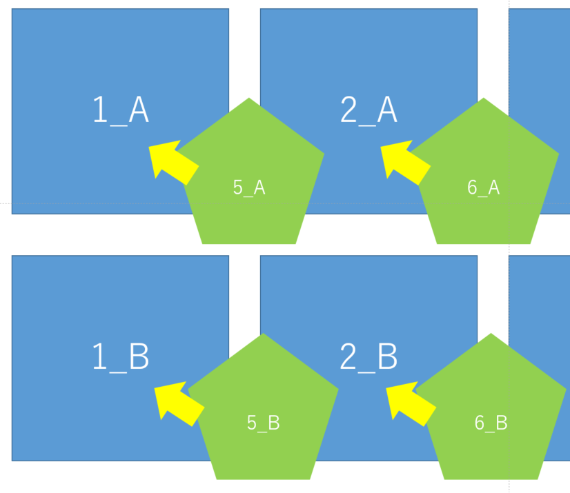

# パワポフォーマット出力 メモ

## リファレンス

### python-pptx
* [Python-pptx 使い方など](https://www.shibutan-bloomers.com/python-libraly-pptx-5/1188/)

### その他
* [Python, pathlibでファイル名・拡張子・親ディレクトリを取得](https://note.nkmk.me/python-pathlib-name-target-parent/)

## やりたいことの整理

1. PowerPointでフォーマットを作成
2. 作成したフォーマットに対応する位置に画像を出力

ただこれだけ。
必要な要素は、フォーマット⇔画像ファイル名の紐付け。

もう少し深掘ると、大きく3パターンのユースケースが考えられる。

☑ 1データ:画像1枚のパターン


スライドにひたすら決まったレイアウトでデータを貼る。

* 連番を指定してもらう
* データの順番を決める必要がある

☑ 1データに複数のレイアウトが存在するパターン(データごとにページ分割)


1スライド1データ、レイアウト⇔フォーマットを対応させたい。

* レイアウト名を指定してもらう
* フォーマット(どのレイアウトか？を表す)⇔画像ファイル名のレイアウト部分の対応
* スライド⇔画像ファイル名のデータ名部分の対応

☑ 1データに複数のレイアウトが存在するパターン(データごとにページ分割しない)


1番厄介。1スライド複数データ、レイアウト⇔フォーマットを対応させる。

* レイアウト名の指定を工夫する？

イメージはこう。

1回目の出力は普通に`1_A`⇔`1_A`、`1_B`⇔`1_B`で対応。

2回目以降は順番に`3_A`⇔`3_A`、`3_B`⇔`3_B`、`5_A`⇔`5_A`、`5_B`⇔`5_B`・・・
となる感じ。


この3パターンの処理を共通化するのは難しそうなので、今回はこれら3パターンを実装、選択出来るようにする。

## python-pptx


基本構成は上の図を参照。
1つ1つの要素はShapeオブジェクトとして管理している。

### Presentation

まずは`Presentation`オブジェクトにアクセスする。

```python
prs = pptx.Presentation(PWT_PATH)
```

空の`Presentation`を作ることも可能。

```python
prs = Presentation()
```

保存は`save`。

```python
prs.save('sample.pptx')
```

### Slide

ファイルを構成する全てのスライドは`Slides`コレクションで管理されている。

```python
# Slidesコレクション取得
prs.slides

# スライドを取得
prs.slides[0]

# スライドを追加
prs.slides.add_slide(side_layouts)
```

#### slide_layouts

`slide_layouts`は、スライドのプレースホルダ(雛形みたいなもの)。
`Presentation`オブジェクトからアクセスする。


```python
prs.slide_layouts[0] # デフォルトは0~8
```

### Shape

```python
shape = slide.shapes
shape[0] # > 1つ目のShapeオブジェクト
```

`Shape`オブジェクトにアクセスしたい場合、対象のオブジェクト(`Slide`)の`shapes`プロパティにアクセスする。
`shapes`は、スライド内にあるすべての要素を管理するイテラブルオブジェクト。

#### shapeが持つプロパティ

* `.text` : テキストを取得・設定

#### 図形の追加

```python
Shapes.add_shape(autoshape_type_id, left, top, width, height)
```

* `autoshape_type` : 図形の種類
* `left` : 図形の左上のx座標
* `top` : 図形の左上のy座標
* `width` : 図形の幅
* `height` : 図形の高さ

#### テキストボックスの追加

```python
Shapes.add_textbox(left, top, width, height)
```

[テキスト操作について](https://www.shibutan-bloomers.com/python-libraly-pptx-2/1024/)

##### TextFrame

テキストを書き込める箇所(テキストボックス、図形など)全てに存在するプロパティ。

##### paragraph

段落。TextFrame>paragraphという構成になっており、段落ごとにフォント・書式などの設定ができる。

```python
txBox = sld0.shapes.add_textbox(left, top, width, height)    #Text Box Shapeオブジェクトの追加

tf = txBox.text_frame		# TextFrameオブジェクトの設定
tf.text = "This is text inside a textbox"            # TextFrameオブジェクトにはデフォルトで1つ段落を持つ

p = tf.add_paragraph()		                           # paragraphオブジェクトの追加作成(2段落目)
p.text = "This is a second paragraph that's bold"    # textプロパティによる文字列の設定
p.font.bold = True		                               # font.boldプロパティによる太文字設定
```

#### 画像の追加

```python
# image_fileは画像パス
picture = Shapes.add_picture(image_file, left, top, width, height)

# トリミングできる
picture.crop_bottom = 0.25 # crop_left/right/top
# 回転もできる
picture.rotation = 45 # +なら時計回り -なら反時計回り
```

### 単位指定

```
from pptx.util import Cm, Inches, Pt
```
* `Cm` : cm単位
* `Inches` : インチ単位
* `Pt` : ポイント単位

## pathlibの基本的な使い方

Pathオブジェクトにファイルパスを渡す。

```python
from pathlib import Path

IMAGE_DIRECTORY = "./resources/images"

# Pathオブジェクトを生成
p = Path(IMAGE_DIRECTORY)
```

様々な条件でパスの探索が可能。

```python
# dir_path直下のファイルとディレクトリを取得
# Path.glob(pattern)はジェネレータを返す。結果を明示するためlist化しているが、普段は不要。
paths = list(p.glob("*"))
# 拡張子 条件指定
paths = list(p.glob("*.jpg"))
# 再帰的な検索は[**]を利用する
paths = list(p.glob("**/*.jpg"))
```

ファイル名などを取得出来る便利なメソッドがある。

```python
paths[0].name   # > test.txt
paths[0].stem   # > test
paths[0].parts  # > a/b/c >> ['a', 'b' ,'c']
```